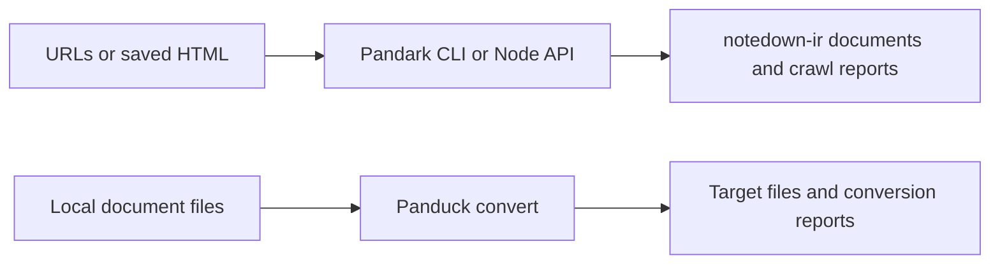

# Pandark

Pandark turns URLs and saved web pages into semantic `notedown-ir` documents and machine-readable crawl reports. Install
`@notedge/pandark` on Node 20 or newer when you need a scriptable CLI or Node API for extraction, bounded collection
planning, or fixture-driven crawling.

**Current release (0.0.2):** architecture skeleton with working extract, inspect, plan, fetch, and crawl entry points,
but **not** a production crawler. Treat network collection as prototype work validated against fixtures and small scopes
until politeness, HTML extraction, and multi-host behavior pass acceptance testing. Panduck converts files you already
have on disk; Pandark collects or extracts from the web.

## 🤖 Use with an agent

`@notedge/pandark-skills` installs **agent instructions only**. It does not install the native binding, add a headless
browser, or make an unbounded site crawl safe.

```bash
npx @notedge/pandark-skills
npx @notedge/pandark-skills -a cursor -y
```

```text
Use Pandark to inspect ./fixtures/page.html and extract a semantic document if this
release supports it. Write new output files and explain any extraction gaps in the report.
```

Full agent workflow: [
`projects/packages/pandark-skills/skills/pandark/SKILL.md`](projects/packages/pandark-skills/skills/pandark/SKILL.md).

## 📦 Install and extract a saved page

```bash
npm install @notedge/pandark
npx pandark doctor
```

Extract a local HTML snapshot to a new document file and report:

```bash
npx pandark extract ./fixtures/page.html \
  --output ./out/page.document.json \
  --report ./out/page.report.json
```

Inspect structure before extraction:

```bash
npx pandark inspect ./fixtures/page.html --json
```

Node API (same engine as the CLI):

```ts
import { loadPandarkNode } from "@notedge/pandark/node";

const pandark = loadPandarkNode();
const result = pandark.extractInput("./fixtures/page.html");
console.log(result.status, result.reportJson);
```

Optional platform packages (`@notedge/pandark-win32-x64`, `@notedge/pandark-darwin-arm64`, and siblings) install
automatically when npm supports your OS and CPU.

## ✅ What works in this release

| Task               | Entry                                                   | Output                                                   |
|--------------------|---------------------------------------------------------|----------------------------------------------------------|
| Extract saved HTML | `pandark extract FILE`                                  | `notedown-ir` document JSON + extraction report          |
| Inspect input      | `pandark inspect FILE`                                  | Stage report (links, metadata, diagnostics)              |
| Plan a crawl       | `pandark plan SEED --depth N --budget M`                | Frontier preview + plan report                           |
| Fetch one seed     | `pandark fetch SEED`                                    | Fetch artifact JSON                                      |
| Bounded crawl      | `pandark crawl SEED --depth N --budget M --report FILE` | Crawl report, `committedPages` list, optional checkpoint |
| Resume             | `pandark resume CHECKPOINT`                             | Continues from a written checkpoint                      |

**Request budget:** `--budget` caps crawl **fetch attempts** for the run. It does not separately cap robots lookups,
retries, or browser activity unless you verify that behavior for your seed and options.

**Reports vs saved bodies:** `--report` writes crawl or extraction diagnostics. It does **not** export every committed
page to disk. Use `committedPages` and your own storage workflow for bulk document export.

**Browser integration:** dynamic pages need a supplied browser endpoint or a **fixture directory**
(`--browser-fixtures-dir`). There is no bundled login-capable headless browser in this release.

**WASM (`pandark-wasm`):** extract, inspect, and plan helpers only. Crawl orchestration is intentionally unavailable in
WASM hosts.



## 📊 Read crawl and extraction results

Crawl and resume commands return a JSON report and a `committedPages` array. Read the report for committed, failed,
skipped, and paused states before assuming the run finished cleanly.

| Field / artifact    | Meaning                                                    |
|---------------------|------------------------------------------------------------|
| `status` on extract | Whether a document was produced or blocked                 |
| `reportJson`        | Diagnostics, coverage, and crawl counters                  |
| `committedPages`    | URLs or paths the run treated as committed                 |
| `checkpointJson`    | Serialized frontier for `pandark resume` when a run pauses |

A zero CLI exit code can still mean partial success. Always open the report when pages are missing or a run stops early.

## 🔧 When something fails

| Symptom                                               | What to check                                                                    |
|-------------------------------------------------------|----------------------------------------------------------------------------------|
| `native bindings are not installed for this platform` | OS/CPU unsupported or optional platform package missing                          |
| Empty document after extract                          | Open the report losses; heuristic HTML extraction may block on unknown markup    |
| Crawl stops below budget                              | Report may show pause, challenge, or policy block—inspect before retrying        |
| Browser fallback did nothing                          | Confirm `--browser-fixtures-dir` or `--browser-endpoint` is set and reachable    |
| Expected site-wide archive                            | This release is not production-ready—reduce scope and verify with fixtures first |

## 🛠 Develop and contribute

From a clone of https://github.com/notedge/pandark:

```bash
pnpm install
pnpm run build:napi
pnpm homepage:check
cargo test --release
pnpm --filter @notedge/pandark test:e2e
```

Rust crates: `pandark-types` (contracts), `pandark-fetch` (transport), `pandark-extract` (semantic extractors),
`pandark-store` (persistence), `pandark` (facade), `pandark-napi` (Node-API), `pandark-wasm` (browser helpers).

License: MPL-2.0
