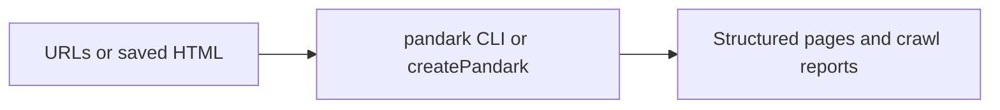

# Pandark

Pandark is an **agent-friendly, TypeScript-first crawler library** with native bindings for speed. Give it URLs or saved
HTML, set a depth and request budget, and get structured page data plus JSON crawl reports you and your coding agent can
inspect.

Install `@notedge/pandark` on Node 20 or newer. Use the **`pandark` CLI**, **`createPandark()`**, or **`@notedge/pandark-skills`** for agent workflows.

**Current release (0.0.2):** working extract, inspect, plan, fetch, and crawl APIs, but **not** a production crawler
yet. Start with saved HTML or small scoped seeds before large site jobs.

## 🤖 Use with an agent

`@notedge/pandark-skills` installs **agent instructions only**—not the runtime, not a browser, and not permission to
crawl without limits.

```bash
npx @notedge/pandark-skills
npx @notedge/pandark-skills -a cursor -y
```

```text
Use Pandark to inspect ./fixtures/page.html and extract a structured document.
Write ./out/page.json and ./out/page.report.json and explain any gaps in the report.
```

Full agent workflow: [
`projects/packages/pandark-skills/skills/pandark/SKILL.md`](projects/packages/pandark-skills/skills/pandark/SKILL.md).

## 📦 Install and try it

```bash
npm install @notedge/pandark
npx pandark doctor
```

CLI:

```bash
npx pandark extract ./fixtures/page.html \
  --output ./out/page.json \
  --report ./out/page.report.json

npx pandark crawl https://example.com/docs \
  --depth 1 \
  --budget 50 \
  --report ./out/crawl.report.json
```

TypeScript:

```ts
import {createPandark} from "@notedge/pandark";

const pandark = createPandark();
const result = pandark.extract("./fixtures/page.html");
console.log(result.status, result.reportJson);
```

Run `npx pandark doctor` if the native binding fails to load on your machine.

## ✅ What you can do today

| Task                   | Command                                   | You get                                       |
|------------------------|-------------------------------------------|-----------------------------------------------|
| Extract saved HTML     | `pandark extract FILE`                    | Structured page JSON + report                 |
| Inspect before extract | `pandark inspect FILE`                    | Links, metadata, diagnostics                  |
| Plan a crawl           | `pandark plan SEED --depth N --budget M`  | Frontier preview + plan report                |
| Fetch one URL          | `pandark fetch SEED`                      | Raw fetch payload JSON                        |
| Crawl with limits      | `pandark crawl SEED --depth N --budget M` | Report, `committedPages`, optional checkpoint |
| Resume                 | `pandark resume CHECKPOINT`               | Continues a paused run                        |

**Budget:** `--budget` caps fetch attempts for the run. **Reports:** `--report` writes diagnostics; it does not dump
every page to disk—check `committedPages` and export yourself. **Dynamic sites:** bring `--browser-endpoint` or
`--browser-fixtures-dir`; there is no built-in login browser.



## 📊 Read the results

Open the JSON report for committed, failed, skipped, and paused pages. A zero exit code can still mean partial success.

| Signal           | Meaning                                    |
|------------------|--------------------------------------------|
| `reportJson`     | Counters, diagnostics, extraction coverage |
| `committedPages` | URLs the run committed                     |
| `checkpointJson` | Resume point when a run pauses             |

## 🔧 When something fails

| Symptom                                               | What to check                                             |
|-------------------------------------------------------|-----------------------------------------------------------|
| `native bindings are not installed for this platform` | Run `npx pandark doctor` and reinstall `@notedge/pandark` |
| Empty extract output                                  | Read the report; complex HTML may be partial              |
| Crawl stops early                                     | Report may show pause or challenge—do not assume success  |
| Need logged-in pages                                  | No bundled browser—provide your own endpoint or fixtures  |

## 🛠 Develop

```bash
git clone https://github.com/notedge/pandark.git
cd pandark
pnpm install
pnpm run build:napi
pnpm check:npm
pnpm --filter @notedge/pandark test:e2e
```

License: MPL-2.0
